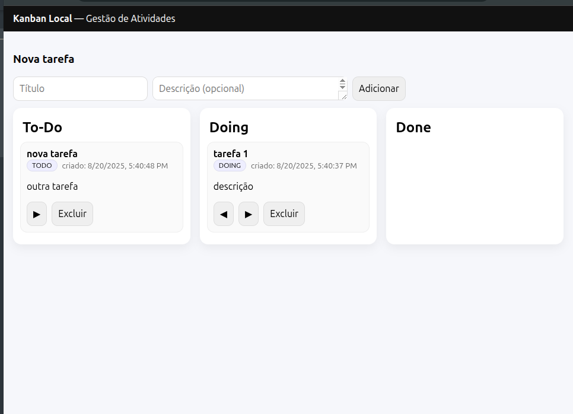

# Kanban Local -- Gestão de Atividades 🖹

Este projeto feito em java é um servidor que serve uma página HTML que permite o usuário criar, gerenciar e excluir tarefas.

## Como o projeto funciona? 🔍

O projeto cria um servidor em java e por meio dele guarda as informações passadas pelo usuário em um arquivo CSV, os dados são passados pelo usuário utlizando o frontend alimentado pelo servidor que se comunica com o backend por meio de uma API para gerenciar as tarefas.

## Como rodar o projeto 🖥

para rodar o projeto utilize os comandos abaixo

- primeiro
  `javac App.java`

Para compilar o projeto.

- e então:
  `java App.java`

Para rodar o código.

Agora acesse http://localhost:8080/ 

E utilize o projeto!

## Como utilizar

### Crie ✔️

Crie uma nova tarefa por meio das caixas de texto e clicando no item adicionar.
(Para criar uma nova tarefa é necessário que exista um título para a tarefa.)

### Gerencie 🛠️

Você pode gerenciar suas tarefas por meio dos status, determinando elas como pendente, fazendo ou feita clicando nas setas de esquerda ou direita assim que estiverem criadas.

### Exclua ❌

Você também pode excluir tarefas por meio do botão de excluir que fica visível nas tarefas assim que criadas.
